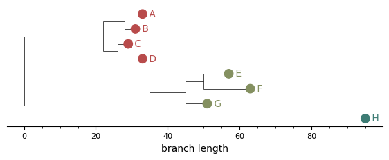
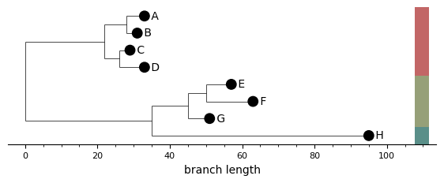
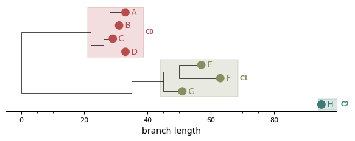
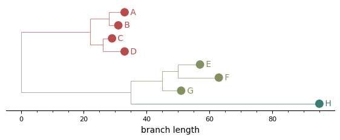
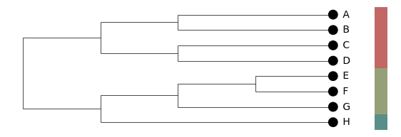
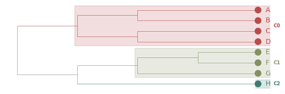
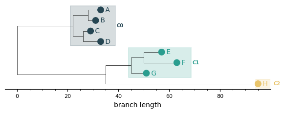

# Visualisation

PhytClust ships a static plotting layer alongside the algorithm. It's matplotlib-based, produces PNG/SVG/PDF, and is the right tool when you want figures for a paper, a notebook, or a batch pipeline. (For interactive exploration, the [web GUI](getting-started.md#web-gui-experimental) is the better fit.)

All examples on this page were generated from the bundled [`examples/sample_tree.nwk`](https://github.com/ICCB-Cologne/PhytClust/blob/master/examples/sample_tree.nwk) at *k* = 3, using `plot_clusters(pc, k=3, ...)`. Run any of these in your own session — every option below is a keyword argument to `plot_clusters` (or directly to `plot_cluster`).

---

## The defaults

The simplest call colours each leaf marker by cluster. Useful as a baseline; with bars or boxes you can take it further.

```python
from phytclust import PhytClust
from phytclust.viz.cluster import plot_clusters

pc = PhytClust("examples/sample_tree.nwk")
pc.run()
plot_clusters(pc, k=3, save=True, results_dir="figures")
```



## Side bars

A column of coloured rectangles to the right of the leaf labels. Each bar spans the y-range of one cluster, and consecutive same-cluster leaves merge into a single rectangle. When bars are on, the leaf markers themselves go neutral — the bars carry the cluster information so colouring leaves on top would be redundant.

```python
plot_clusters(pc, k=3, show_cluster_bars=True, ...)
```



## MRCA boxes

A translucent rectangle per cluster, rooted at the cluster's MRCA and extending to the right edge of its leaves. The cluster ID label sits to the right of each box. Outlier clusters (cluster ID < 0) get a dashed open box for visual distinction.

This is the static analogue of the GUI's **Boxes (MRCA)** colour mode.

```python
plot_clusters(pc, k=3, show_cluster_boxes=True, ...)
```



## Branches coloured by cluster

Every edge inside a cluster's subtree — including the vertical "spine" lines connecting children — picks up the cluster colour. Mixed-cluster edges and the backbone of the tree stay grey, so cluster boundaries read at a glance.

```python
plot_clusters(pc, k=3, colour_branches_by_cluster=True, ...)
```



## Cladogram layout

`layout="cladogram"` ignores branch lengths and places every leaf at the same depth so the tree's right edge is flush. Useful for trees where the topology matters more than the absolute branch-length scale, or where rate variation makes the phylogram hard to read. The branch-length axis is automatically hidden in this mode (it carries no biological meaning).

```python
plot_clusters(pc, k=3, layout="cladogram", show_cluster_bars=True, ...)
```



## Combinations: a publication-style plot

Most options compose. A common combination for a manuscript figure: cladogram layout, branches coloured by cluster, MRCA boxes for emphasis.

```python
plot_clusters(
    pc,
    k=3,
    layout="cladogram",
    colour_branches_by_cluster=True,
    show_cluster_boxes=True,
    ...
)
```



## Custom palettes

Pass a `palette` of hex strings or RGB(A) tuples — it overrides the default palette. The list will be cycled if you have more clusters than colours.

```python
plot_clusters(
    pc,
    k=3,
    show_cluster_boxes=True,
    palette=[
        "#264653", "#2a9d8f", "#e9c46a", "#f4a261",
        "#e76f51", "#8ecae6", "#219ebc", "#023047",
    ],
    ...
)
```



---

## All options at a glance

| Argument | Default | What it does |
|---|---|---|
| `k` / `top_n` | `top_n=1` | Either an explicit cluster count, or use the top-N peaks |
| `show_cluster_bars` | `False` | Side bars to the right of leaves |
| `show_cluster_boxes` | `False` | MRCA-rooted translucent rectangles |
| `colour_branches_by_cluster` | `False` | Tint edges inside each cluster subtree |
| `layout` | `"rectangular"` | `"rectangular"` (phylogram) or `"cladogram"` |
| `palette` | `None` | List of hex / RGB / RGBA colours |
| `cmap` | `"phytclust"` | Matplotlib colormap name (used when `palette` is `None`) |
| `show_branch_axis` | `True` | Draw the bottom branch-length axis (auto-hidden for cladograms) |
| `width_scale` / `height_scale` | `2.0` / `0.1` | Per-leaf horizontal and vertical scaling |
| `marker_size` | `40` | Leaf marker size in points² |
| `hide_internal_nodes` | `True` | Suppress internal node markers and labels |
| `save` / `filename` / `results_dir` | `False` | Write the figure to a PNG |

For full kwargs see the [Python API reference](reference/api.md).
